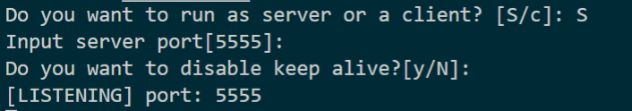
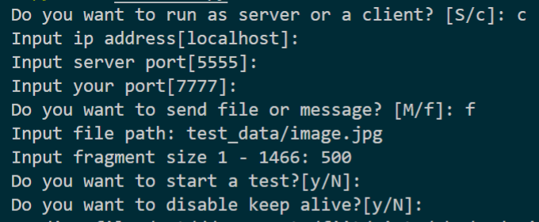
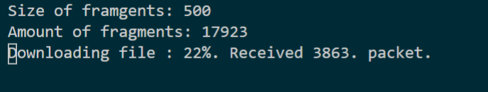

# udp-communicator
UDP communicator is a school assignment where we created a custom connection-oriented protocol on top of UDP communication to transfer files.

## Demo
After running the application, you will choose between Server (receiver) and Client (sender). Both sides have different options for setting up connections.
On the Server, you need to specify a port on which you want to start listening.


On the Client, you need to set more parameters. The most important parts are the Server's port, IP address, content to send, and segment size of a packet. You can send plain text or any file.  



While the program is downloading, the Server side is showing the progress. After a successful download, the program will save a new file in a local directory.  


## Instalation
The program works on Windows and Linux operating systems. To run it, you need to have Python3.x and PIP3 installed.
Install the required libraries:
```
pip install -r requirements.txt
```
To use the program, you can run: 
```
python3 src/main.py
```
